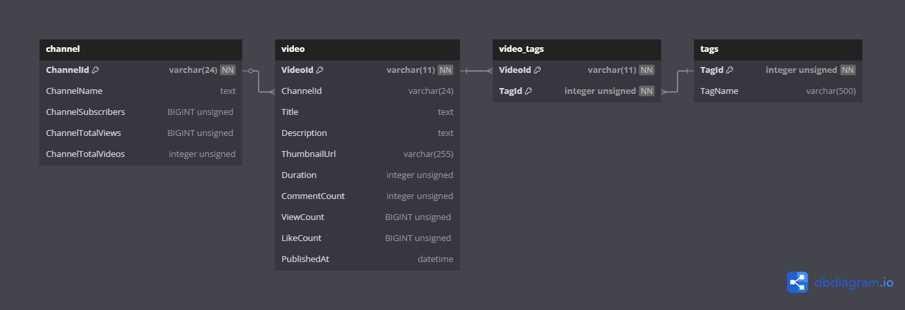

# VtuberDataCollecter
利用YoutubeAPI收集資料並建立可視化模型


## 使用技術 (Tech Stack)
- 開發語言：C# (.NET 8)
- 數據處理：SQLite(將改成MySQL)
- 視覺化：預計用Web Dashboard


## 安裝與使用方式 (Installation & Usage)
1. **Clone 專案**：
   ```sh
   git clone https://github.com/XZ1-1/VtuberDataCollecter.git


## 設定 API Key
- 本專案使用 YouTube API，需要設定 API Key：
> dotnet user-secrets set "YouTubeApiKey" "your-api-key-here"


## Database Schema

